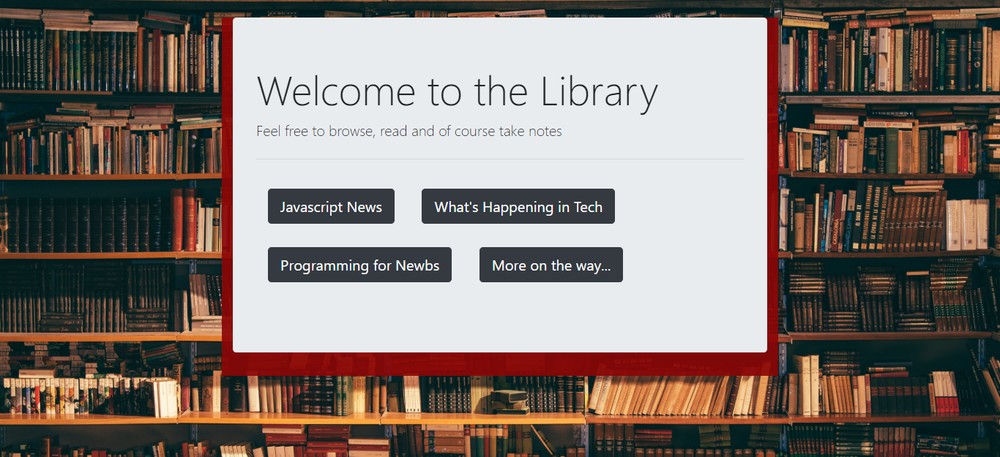

# Scraper

## About
The Library scrapes tech related articles and allows users to create their own notes.  This is the perfect study tool for the modern academic.
## Guide
Choose the collection you're interested in and get to reading.  Write notes as you go.  Then when you need to review you can go to the notes page and see all of your notes in one place.
## Deploy
https://warm-thicket-80199.herokuapp.com

## Coming Soon
#### User Login
Users will be able to login and save articles that they're interested in into their own person library.
#### User Subject Collections
Label saved articles and notes with individualized tags for easy retrieval and study

## Author
Tierra Farris